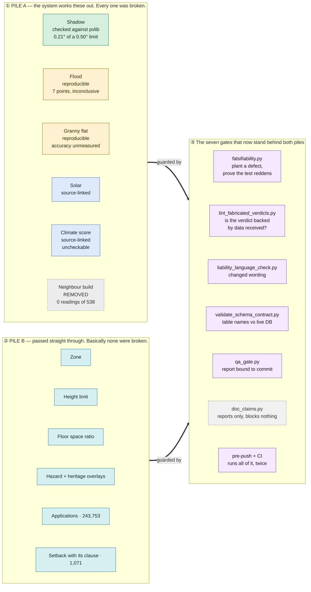

# The shape of it, in one picture

**Measured 2026-08-09 against `origin/main` at `af7982a8`.** Evidence for every box and every
count is in [VERIFICATION.md](VERIFICATION.md). The technical version of this is
[SYSTEM_TECHNICAL.md](SYSTEM_TECHNICAL.md).

If you only read one thing on this page, read this:

> **Sort every output into two piles. Things the system works out for itself, and things it
> simply passes along. Every single one in the first pile was broken. Basically none in the
> second pile were.**

That is not a quality problem. It is a design finding, it was found by building machinery to
look for it, and the machinery is now standing.

---

---

## How to read the colours

| Colour | What it means | How many |
|---|---|---|
| **Green — checked against something outside itself** | Compared against an independent authority that could have disagreed, against a pass mark written down *before* the test ran. | **One product.** Shadow sun-geometry. |
| **Amber — reproducible** | Re-running a committed recipe gives the same number. Nothing external has confirmed it is right. | Flood, granny flat. |
| **Blue — source-linked** | We can show where the number came from. That is all. | Solar, climate. |
| **Teal — pass-through** | Not worked out by us at all. Reported as it came from the source, with the source named. | All of Pile B. |
| **Grey dashed** | Removed, or reports without blocking. | The neighbour-construction feature; the doc checker. |

Teal and green are deliberately different. Pile B is not "checked" — it has never needed
checking, which is the whole point.

The word **"verified"** is banned in this project as an umbrella term, because it implies all
three rungs at once. Everything above uses the rung it actually sits on.

Pile B is safe for a specific reason: **a fact with a source attached is nearly free and nearly
always right.** Every number the system works out for itself becomes a permanent liability — it
needs re-checking forever, it goes stale, and it fails quietly.

---

## What the fortnight actually removed

Not a tidy-up. Six things that were untrue and are now gone:

- A **paid feature** that had never once returned a reading in 538 attempts.
- A scientific library named as our method on the report, the marketing page and the disclaimer,
  which no code has ever used.
- A panel that showed a customer their neighbours' street addresses beside an invented rent figure.
- A flood answer that told addresses in **Lismore and Murwillumbah** they were not in a flood
  zone, from a check that never ran.
- A test suite that had silently stopped running for three days while reporting success.
- A safety library named in production that was never installed, so four checks did nothing for months.

---

## The one asset that does not melt

**181,737 complying development certificates. 128 councils. July 2018 to August 2026.**

A record of what actually got approved — not what the rules say, but what got through. It is
different in kind from everything else here:

- **It is a record, so there is nothing to calibrate.** You report it. No confidence story, no
  quiet failure mode.
- **Nobody can copy it** without the same eight years of collecting.
- **It survives the reforms.** When NSW publishes structured planning controls at source, that
  erodes the rules-based products and does nothing at all to this one.

Alongside it sit 62,016 development applications — though those only run back to May 2025, so
the eight-year depth belongs to the certificates alone.

---

## Honest limits of this page

The two piles are a real finding, not a marketing frame — but the boundary is a judgement, and
two items sit near it. Setbacks are drawn in Pile B because each number is stored with the
sentence it came from; the *extraction* that produced them is derived work, and 528 of the 1,071
have no committed recipe to re-run. Flood sits in Pile A because the yes/no is worked out, even
though its inputs are pass-through map layers.

The gates are young. They were built between 6 and 8 August 2026, which is days, not years, of
evidence that they hold. What can be said is narrower and more useful: each one blocks a
specific failure that actually happened, and `falsifiability.py` exists precisely because a test
that has never been shown to fail proves nothing.
