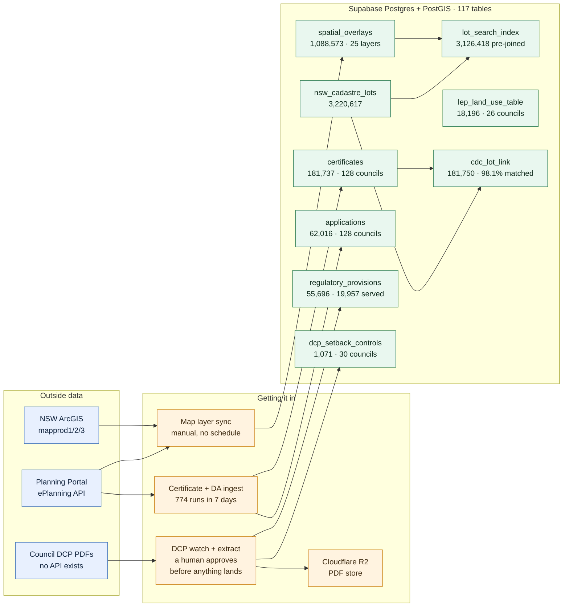
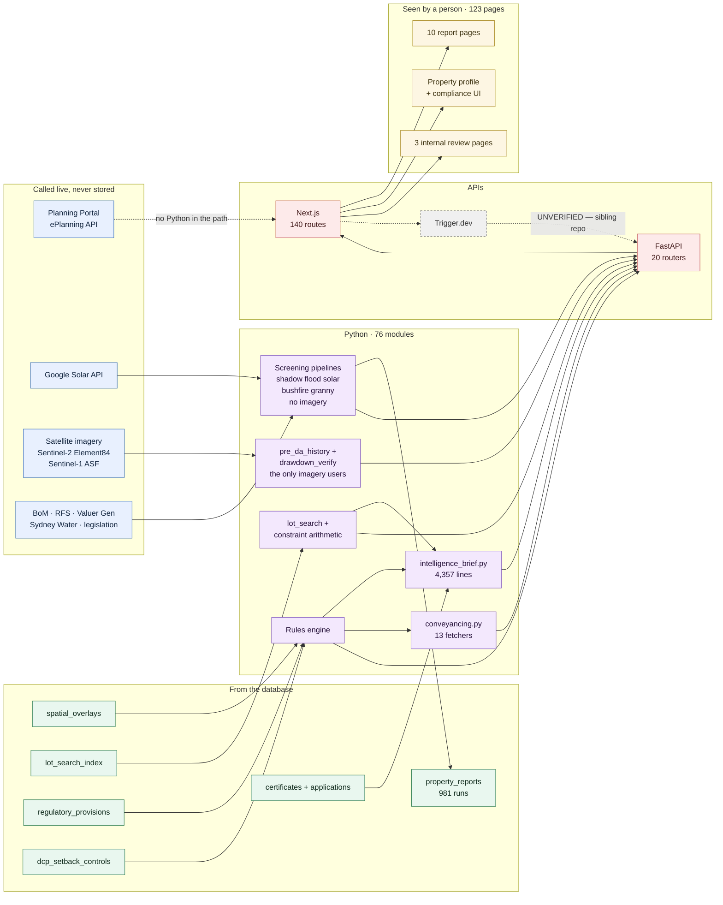
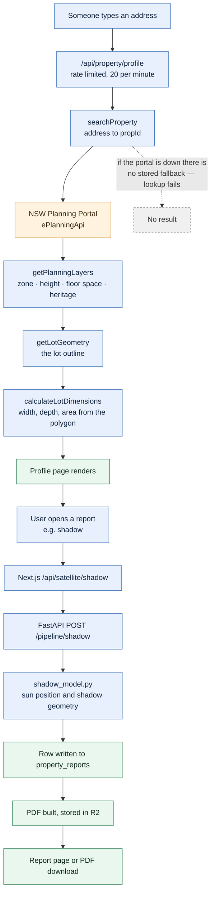

# What the system is, technically

**Measured 2026-08-09 against `origin/main` at `af7982a8`.** Every number and every arrow
below has a row in [VERIFICATION.md](VERIFICATION.md) giving the query or the file and line
that produced it. If you want to check one, start there — it is written for a reader who
assumes I am wrong.

Three diagrams. The first two split the system the way it actually divides — **what gets stored**
and **what gets served**. The third follows a single address all the way through, because "trace
one lookup end to end" is the question a reviewer actually asks.

Older architecture notes exist at `docs/ARCHITECTURE.md` and `.claude/docs/ARCHITECTURE.md`.
**Both are stale and should not be used** — see the note at the foot of this page.

---

## 1. What gets stored

Three sources, four intake paths, one database. This half runs on a schedule — or, in one case,
does not.

`cdc_lot_link` was added on 2026-08-10 and is the only box on this diagram that is derived from
two others rather than ingested. It ties each certificate to the lot its coordinates fall inside,
which is what turns "what got approved at this address" into "what got approved on lots like this
one". 178,259 of 181,750 matched — 98.1%.

---

## 2. What gets served

The other half. Note that several sources appear here and **not** in the diagram above — they are
called live, per request, and never stored.

**Three things worth noticing on those pictures.**

The dotted line from the Planning Portal to the browser layer is a real edge, not decoration. The
Next.js layer talks to the government API **directly**, with no Python in the path —
`frontend-nextjs/lib/nsw-planning-portal.ts` holds nineteen of those calls in one file. Anyone
assuming all data flows through the Python backend has the shape wrong.

The Trigger.dev hop is drawn dashed and labelled **UNVERIFIED** on purpose. I can point at the
Next.js code that calls it. I cannot point at what it calls next, because those task definitions
live in a different repository that is not in this one. So I have not drawn a line I cannot show you.

**Only two modules touch satellite imagery**, and they are not the ones you would guess.
`pre_da_history.py` pulls Sentinel-2 from Element84, and `drawdown_verify.py` pulls Sentinel-1
through the Alaska Satellite Facility. Shadow, flood, solar, bushfire and granny flat use none.
I nearly drew that edge wrongly: a plain search for "sentinel" across `services/` matches five
more files, but in `bushfire_prescreen.py`, `cdc_screen.py` and `solar_yield.py` the word means
a *sentinel value* — a programming term with nothing to do with satellites. Opening each file
was the difference between a true diagram and a plausible one.

`dcp_setback_controls` is small — 1,071 rows — and it is the one box on these diagrams that
nobody else has. Everything else on the data row is either public, purchasable, or reproducible
by anyone with the same eight years. That table holds numbers pulled out of council PDFs as
numbers, each stored next to the exact sentence it came from.

---

## 3. One address, end to end

This is what happens when someone types an address into the property profile page. It is the
shortest complete path through the system, and the one to walk if you are checking whether the
diagrams above are honest.

The important detail in that diagram is the dotted line at the bottom. Zone, height and floor
space ratio are fetched **live from the government portal on every lookup**. They are not served
from our database. That is why they have been reliable, and it is also why a portal outage is a
total outage for that page.

---

## 4. Where the data stops

Counts alone flatter the system, so here is the other half, measured the same day.

| Thing | Measured | The limit |
|---|---|---|
| Mapped shapes | 1,088,573 across 25 layers | A snapshot, not a feed. Last sync ran between 13 April and 8 July 2026, by hand. |
| Layer coverage | Uneven | Zoning 128 councils, heritage 127, lot size 127 — but floor space 65, height 75, landslide 6. |
| Bushfire and fire history | 263,276 shapes | **No currency date at all.** Their age is unknown, not merely old. |
| Numeric DCP controls | 1,071 rows, 989 live | About 36 per council. Thin, and it is the true size of the defensible surface. |
| Controls with a machine-followable link back to the clause | **42 of 1,071** | The other 1,029 have the sentence and the clause reference, but no join. |
| Controls with a date they came into force | **365 of 1,071** | For 706 we cannot state when the control started applying. |
| DCP clause corpus | 55,696 rows, 19,957 served | Only 2,069 carry a number. The arithmetic surface is ~2,000 clauses plus the 1,071 controls — not 55,696. |
| Development applications | 62,016 | Determinations run from **23 May 2025**, not 2018. Only the certificates go back to 2018. |
| Stored report runs | 981 | There is no identity column on that table. These are runs, not customers. |

---

## 5. A note on the older architecture docs

`docs/ARCHITECTURE.md` (dated 2026-05-02) and `.claude/docs/ARCHITECTURE.md` (2026-01-30) both
open with "47,818 provisions." That number is the row count of `document_id_backup` — a backup
table. The live figure is 55,696 rows of which 19,957 are served. Both files also list endpoints
that have since moved.

I have left them in place rather than deleting them, and this file supersedes them. If you are
reading them for anything load-bearing, stop and use this one.
