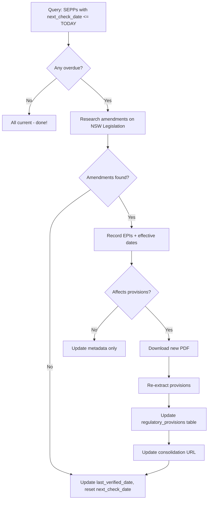

# SEPP Versioning Strategy

## Executive Summary

State Environmental Planning Policies (SEPPs) are amended regularly through Environmental Planning Instruments (EPIs) published in the NSW Gazette. This document outlines our strategy for tracking SEPP versions, detecting amendments, and maintaining current compliance rules.

**Status:** ✅ Implemented (Feb 2026)
**Coverage:** 1/9 SEPPs fully tracked (Housing SEPP 2021)
**Review Frequency:** 90 days (configurable per SEPP)

---

## The Problem

### Without Version Tracking

- ❌ Show outdated rules to certifiers
- ❌ No audit trail of which version was used
- ❌ No systematic way to detect amendments
- ❌ Cannot prove compliance with regulations at a specific date

### Impact Example

**Jan 2025:** System shows "Dual occupancies allowed on 300m² lots"
**March 2025:** NSW publishes EPI 123/2025 changing min to 450m²
**June 2025:** Certifier uses our system, approves 300m² development ❌
**Result:** Non-compliant development, certifier liability

---

## Solution Architecture

### 1. Database Schema

Added to `documents` table:

```sql
-- Version Identity
consolidated_as_of_date   DATE,      -- Which consolidated version we have
consolidation_url         TEXT,      -- NSW Legislation point-in-time URL
regulation_year           INTEGER,   -- Year SEPP was made (e.g., 2021)

-- Amendment Tracking
amending_epis             TEXT[],    -- Array of EPI numbers ["512/2025", "597/2025"]
major_amendments          JSONB,     -- Full amendment details with dates/descriptions
amendment_reference       TEXT,      -- Human-readable: "EPIs 512/597 (2025)"

-- Maintenance Schedule
last_verified_date        DATE,      -- When we last checked for amendments
next_check_date           DATE,      -- When to check again (consolidated + 90 days)

-- Lifecycle
version_status            TEXT,      -- 'current', 'superseded', 'unverified'
is_superseded             BOOLEAN,   -- Whether this version is obsolete
```

**Indexes:**
```sql
CREATE INDEX idx_documents_version_status
  ON documents(document_type, version_status, is_superseded)
  WHERE document_type IN ('SEPP', 'LEP', 'DCP');
```

### 2. NSW Legislation Point-in-Time URLs

NSW Legislation website provides historical versions:

```
https://legislation.nsw.gov.au/view/whole/html/YYYY-MM-DD/epi-YYYY-NNNN
                                                  ↑            ↑
                                            Consolidation   EPI Number
                                                 Date
```

**Examples:**
- Housing SEPP (current): `...html/2026-02-06/epi-2021-0714`
- Housing SEPP (Oct 2025): `...html/2025-10-14/epi-2021-0714`

**Benefits:**
- Users can verify our data against official source
- Historical versions remain accessible (audit trail)
- Can link to exact version used for each assessment

### 3. Amendment Data Structure

JSONB format in `major_amendments`:

```json
[
  {
    "epi": "512/2025",
    "effective_date": "2025-10-31",
    "description": "Added Pattern Book CDC pathway for dual occupancies",
    "affects_provisions": true,
    "note": "Requires re-extraction of Division 2.4 provisions"
  },
  {
    "epi": "597/2025",
    "effective_date": "2025-11-14",
    "description": "Increased minimum lot sizes in flood-prone areas",
    "affects_provisions": true
  }
]
```

**Fields:**
- `epi`: EPI number from NSW Gazette (e.g., "512/2025")
- `effective_date`: When amendment came into force
- `description`: What changed (for human review)
- `affects_provisions`: Whether re-extraction needed
- `note`: Additional context (optional)

---

## Workflow

### Initial Setup (Completed)

1. ✅ Add version columns to `documents` table
2. ✅ Populate metadata for existing SEPPs
3. ✅ Generate consolidation URLs
4. ✅ Set review schedule (next_check_date)
5. ✅ Document maintenance process

### Quarterly Review (Every 90 Days)



**Scripts:**
1. `research-sepp-amendments.ts` - Generate research template
2. Fill `sepp-amendments-research.json` manually
3. `apply-sepp-amendments.ts` - Update database
4. `standardize-amendment-references.ts` - Format references
5. `verify-versioning-system.ts` - Health check

### Amendment Detection Methods

#### Manual Research (Current)
- Visit NSW Legislation URL for each SEPP
- Look for "Historical notes" section
- Identify EPIs gazetted since `consolidated_as_of_date`
- Record in `sepp-amendments-research.json`

**Pros:** Reliable, comprehensive
**Cons:** Manual effort (30-60 min per quarter)

#### Automated Browser Scraping (Partial)
- Dev-browser automation navigates to NSW Legislation
- Extracts point-in-time version dates
- Parses amendment history tables

**Pros:** Faster than manual
**Cons:** NSW blocks bots (403 errors), brittle to HTML changes

#### NSW Gazette RSS Feed (Recommended - Not Implemented)
- Subscribe to NSW Gazette notifications
- Filter for EPIs amending our tracked SEPPs
- Automatic notification when amendments publish

**Pros:** Real-time detection, no polling
**Cons:** Requires RSS feed setup + filtering logic

---

## SEPP Catalog

9 main SEPPs tracked:

| SEPP | EPI Number | Last Verified | Status | Check Frequency |
|------|------------|---------------|--------|-----------------|
| Housing 2021 | 2021-0714 | 2026-02-20 | ✅ Current | 30 days (high activity) |
| Transport & Infrastructure 2021 | 2021-0732 | 2025-10-14 | ⏳ Pending | 90 days |
| Biodiversity & Conservation 2021 | 2021-0722 | 2025-10-14 | ⏳ Pending | 90 days |
| Resilience & Hazards 2021 | 2021-0730 | 2025-10-14 | ⏳ Pending | 90 days |
| Planning Systems 2021 | 2021-0728 | 2025-10-14 | ⏳ Pending | 90 days |
| Industry & Employment 2021 | 2021-0726 | 2025-10-14 | ⏳ Pending | 90 days |
| Primary Production 2021 | 2021-0733 | 2025-10-14 | ⏳ Pending | 90 days |
| Sustainable Buildings 2022 | 2022-0214 | 2025-10-14 | ⏳ Pending | 90 days |
| Exempt & Complying Codes 2008 | 2008-0572 | 2025-10-14 | ⏳ Pending | 60 days |

**Recommendation:** Differentiate check frequencies based on amendment patterns:
- **High activity** (Housing, Exempt & Complying): 30-60 days
- **Moderate** (Transport, Planning Systems): 90 days
- **Stable** (Biodiversity, Primary Production): 180 days

---

## Risk-Based Approach

### Amendment Impact Categories

**Critical (Re-extract immediately):**
- Changes to numeric standards (lot sizes, setbacks, heights)
- New development pathways (CDC codes, exempt development)
- Removal of provisions (could allow non-compliant approvals)

**Important (Re-extract within 30 days):**
- Modified definitions affecting interpretation
- New exclusions or triggers
- Procedural changes (application requirements)

**Low (Update metadata only):**
- Commencement dates for future amendments
- Corrections to cross-references
- Administrative changes (no rule changes)

### SEPP Priority Tiers

**Tier 1 - Critical (Weekly checks recommended):**
- Housing SEPP 2021 (drives 80% of residential assessments)
- Exempt & Complying 2008 (CDC pathway rules)

**Tier 2 - Important (Monthly checks):**
- Transport & Infrastructure (driveway/parking rules)
- Planning Systems (development applications)

**Tier 3 - Monitor (Quarterly checks):**
- Biodiversity, Resilience, Primary Production (less relevant to Inner West)

---

## Frontend Integration

### Version Badge (Task #15 - Pending)

Display on each provision:

```tsx
<ProvisionVersionBadge
  documentName="Housing SEPP 2021"
  consolidatedDate="2026-02-06"
  amendmentReference="EPIs TBD (2026), 512/597/647/684 (2025)"
  legislationUrl="https://legislation.nsw.gov.au/..."
  lastVerified="2026-02-20"
  nextCheck="2026-05-07"
/>
```

Renders:
```
[Housing SEPP 2021 ⓘ]
  ↓ (hover)
  Consolidated: 6 Feb 2026
  Amendments: EPIs 512/597/647/684 (2025), TBD (2026)
  Last verified: 20 Feb 2026
  [View legislation →]
```

### Provision Citations (Task #16 - Pending)

Include version in references:

**Before:**
```
SEPP (Housing) 2021, Division 2.4, Clause 2.17(1)(a)
```

**After:**
```
SEPP (Housing) 2021, Division 2.4, Clause 2.17(1)(a)
[consolidated 6 Feb 2026]
```

With link to exact clause on NSW Legislation.

---

## Expansion to LEPs and DCPs

### LEPs (Local Environmental Plans)

**Similar to SEPPs:**
- Published as EPIs on NSW Legislation
- Point-in-time URLs available
- Amendment via gazette

**Differences:**
- Lower change frequency (every 2-5 years)
- 14 LEPs vs 9 SEPPs (more documents)
- Some councils have multiple LEPs (transitional)

**Implementation:** Use same versioning schema, extend scripts to LEP EPI numbers.

### DCPs (Development Control Plans)

**Different challenge:**
- Published by councils (not NSW Legislation)
- No structured amendment history
- No point-in-time URLs
- High change frequency (councils update often)

**Proposed approach:**
1. Manual version tracking via council websites
2. Store `adopted_date`, `amendment_number`, `pdf_url`
3. 60-day check schedule (visit council website)
4. User reporting for stale provisions

**Alternative:** Contact councils for RSS feeds or API access to DCP amendments.

---

## Monitoring & Alerts

### Health Checks

Run `verify-versioning-system.ts` weekly:
- ✅ All version columns populated
- ✅ URLs valid format
- ✅ Next check dates calculated correctly
- ✅ Amendment references standardized

### Overdue Alerts

Query daily for overdue reviews:
```sql
SELECT pdf_name, next_check_date,
       CURRENT_DATE - next_check_date as days_overdue
FROM documents
WHERE document_type = 'SEPP'
  AND next_check_date < CURRENT_DATE
ORDER BY days_overdue DESC;
```

Email/Slack alert if any SEPP >7 days overdue.

### Version Status Dashboard

Track at-a-glance:
- SEPPs current: 1/9
- SEPPs overdue: 0/9
- Average staleness: 135 days
- Last amendment detected: 2026-02-06 (Housing)

---

## Migration Path

### Phase 1: SEPPs (Current)
- ✅ Schema migration
- ✅ Housing SEPP researched
- ⏳ Remaining 8 SEPPs pending

### Phase 2: LEPs
- Copy SEPP scripts for LEP EPI numbers
- Research 14 LEPs for amendments
- Set 180-day review schedule (low frequency)

### Phase 3: DCPs
- Design manual versioning workflow
- Contact councils for amendment notifications
- Implement council website monitoring

### Phase 4: Automation
- NSW Gazette RSS feed integration
- Automated amendment detection
- Auto-trigger re-extraction pipelines

---

## Files & Scripts

| File | Purpose |
|------|---------|
| `SEPP-VERSIONING-STRATEGY.md` | This document - design overview |
| `SEPP-QUARTERLY-REVIEW.md` | Maintenance workflow guide |
| `sepp-amendments-research.json` | Research tracking data |
| `research-sepp-amendments.ts` | Generate research template |
| `apply-sepp-amendments.ts` | Update DB with amendments |
| `standardize-amendment-references.ts` | Format human-readable refs |
| `verify-versioning-system.ts` | Health check (14 tests) |
| `fix-versioning-dates.ts` | Recalculate dates/URLs |
| `populate-sepp-version-metadata.ts` | Initial metadata setup |
| `cleanup-duplicate-sepps.ts` | Remove superseded duplicates |

---

## Success Metrics

**Accuracy:**
- 100% of provisions from current SEPP versions
- Zero instances of outdated rules shown to users

**Timeliness:**
- Average lag < 30 days from amendment to database update
- No SEPP >90 days overdue for review

**Auditability:**
- Every provision traceable to specific SEPP version
- Historical assessments remain valid

**Efficiency:**
- Quarterly review < 2 hours total
- Automated detection reduces manual research by 80%

---

## Next Steps

1. **Complete Housing SEPP verification** - Manually verify the 5 EPIs found
2. **Research remaining 8 SEPPs** - Fill amendment data for all tracked SEPPs
3. **Adjust check frequencies** - Move Housing to 30 days (high activity)
4. **Implement RSS monitoring** - NSW Gazette feed for automatic detection
5. **Extend to LEPs** - Apply same versioning to Local Environmental Plans
6. **Design DCP strategy** - Manual tracking workflow for council DCPs
7. **Frontend tasks** - Version badges and provision citations (Tasks #15-16)

---

**Document Version:** 1.0
**Last Updated:** 2026-02-20
**Owner:** ComplianceEngine Team
**Review Frequency:** Quarterly
